<!-- ╔══════════════════════════════════════════════════════════════╗ -->
<!-- ║  Armaan Punia · GitHub profile README                          ║ -->
<!-- ║  Assets live in /assets · snake graph is built by GitHub Action║ -->
<!-- ╚══════════════════════════════════════════════════════════════╝ -->

<div align="center">



<br/>

<a href="https://linkedin.com/in/armaan-punia"></a>&nbsp;
<a href="https://leetcode.com/u/Armaan0904/"></a>&nbsp;
<a href="mailto:armaanpunia94@gmail.com"></a>&nbsp;
<a href="https://github.com/Armaan-94"></a>

</div>

<br/>


## whoami

I build backend systems and AI-powered products — the kind that run in production and move real numbers, not just demos. I'm finishing my **B.Tech in Computer Science** (CGPA 8.79) while shipping enterprise software across three engineering internships, most recently working with data at nine-figure scale.

My centre of gravity is **distributed backend architecture** and **applied AI**: Spring Cloud microservices on one side, LLM agents, RAG and MCP workflows on the other — with cloud infrastructure holding it together.

```yaml
role:      Software Engineer  ·  final-year CS
strengths: [ distributed backend, applied AI, data engineering, cloud ]
stack:     Java · Spring Cloud · Python · TypeScript · Next.js · AWS
mindset:   design for scale, ship to production, measure the impact
```


## What I've shipped

> Impact over feature-lists — a few things I actually built and the difference they made.

- **Turned 160M+ customer records into decisions.** Built an AI-driven business-intelligence and large-scale data-processing layer that lifted profitability **~18%** across a financial-services line — `Next.js` · `TypeScript` · `Python` · `DuckDB` · AI/ML workflows.
- **Governed enterprise data for a US client.** Delivered end-to-end metadata and technical-lineage migration into **Collibra DGC**, with `Spring Boot` middleware that parsed Alteryx workflows and published assets through Collibra REST APIs.
- **Designed a distributed food-delivery platform.** Independent `Spring Cloud` microservices with service discovery, API-gateway routing, centralized config, and secured auth.
- **Automated the boring parts of enterprise ops.** Production ERP/CRM features and AI communication modules (Voice · SMS · Email · WhatsApp) that cut manual work and consolidated business services.


## Current focus

<table>
<tr>
<td width="33%" valign="top">

**⚙️&nbsp; Distributed systems**

Cloud-native design, resilient service boundaries, and the tradeoffs that show up only at scale.

</td>
<td width="33%" valign="top">

**🤖&nbsp; Agentic AI**

Production-grade LLM workflows — RAG pipelines, MCP tooling, and agents that do real work reliably.

</td>
<td width="33%" valign="top">

**📈&nbsp; Data engineering**

Moving from millions of rows to insight — analytical stores, query performance, and clean pipelines.

</td>
</tr>
</table>


## Tech stack

<div align="center">

**Languages & Backend**  


**Frontend**  


**Data & Cloud**  


**Workflow**  


<br/>

**AI Engineering**  


</div>


## Featured projects

<table>
<tr>
<td width="50%" valign="top">

### 🍱 &nbsp;Food-Delivery Microservices
A distributed food-delivery backend built as independent Spring Cloud services — the project where I put microservice theory into practice.

**Highlights**
- Service discovery + API-gateway routing
- Centralized configuration server
- Secured authentication with Spring Security

`Spring Boot` · `Spring Cloud` · `Spring Security` · `MySQL`

<a href="https://github.com/Armaan-94?tab=repositories"></a>

</td>
<td width="50%" valign="top">

### 🗄️ &nbsp;Developer Snippet Vault
A full-stack tool to store, search, and manage reusable code snippets — REST API backend with a responsive, modern UI.

**Highlights**
- CRUD + full-text search over snippets
- Clean REST API with Express
- Responsive Tailwind interface

`React` · `Node.js` · `Express` · `MongoDB` · `Tailwind`

<a href="https://github.com/Armaan-94?tab=repositories"></a>

</td>
</tr>
<tr>
<td width="50%" valign="top">

### 🏦 &nbsp;Bank Landing Page
A modern, fully responsive banking landing page — a study in clean layout, spacing, and cross-device polish, designed in Figma and built in React.

**Highlights**
- Pixel-consistent responsive layout
- Component-driven React + Tailwind
- Figma → code workflow

`React` · `Tailwind` · `JavaScript` · `Figma`

<a href="https://github.com/Armaan-94?tab=repositories"></a>

</td>
<td width="50%" valign="top">

### 🔭 &nbsp;More on the way
I ship in the open. New work lands on my repositories tab regularly — backend experiments, AI tooling, and the occasional weekend build.

<br/>

<a href="https://github.com/Armaan-94?tab=repositories"></a>

</td>
</tr>
</table>


## By the numbers

<div align="center">

&nbsp;
&nbsp;
&nbsp;


<br/>
<sub>Numbers that matter more than my commit count — impact shipped across three internships.</sub>

</div>


## Contribution graph

<div align="center">

<picture>
  <source media="(prefers-color-scheme: dark)" srcset="https://raw.githubusercontent.com/Armaan-94/Armaan-94/output/snake-dark.svg" />
  <source media="(prefers-color-scheme: light)" srcset="https://raw.githubusercontent.com/Armaan-94/Armaan-94/output/snake-light.svg" />
  
</picture>

</div>


## Let's talk

I'm open to **software-engineering roles and internships** and to interesting problems in backend, AI, or infrastructure. The fastest way to reach me:

<div align="center">

<a href="mailto:armaanpunia94@gmail.com"></a>&nbsp;
<a href="https://linkedin.com/in/armaan-punia"></a>&nbsp;
<a href="https://leetcode.com/u/Armaan0904/"></a>

</div>

<br/>


<div align="center">
<sub></sub>
</div>
